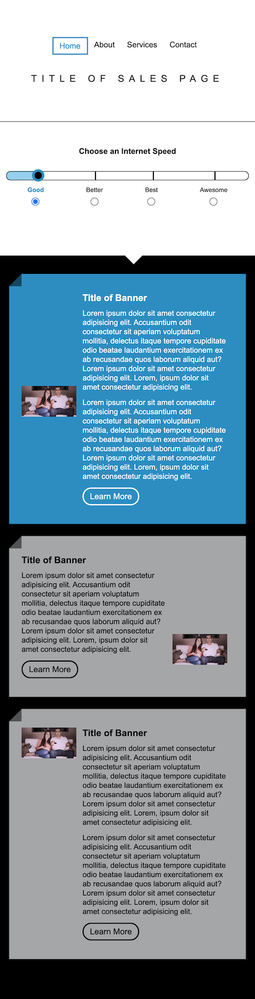

# UI Test
Old UI test from a Comcast dept

[Deployed Page Link](http://www.natemking.dev/ui_test/)

## Description
This repo is an old test that a department at comcast used to give potential new hires to complete. The challenge is to create the page from scratch as per the instructions below within 24 hours of beginning. The slider must be fully functional and the page mobile responsive. 

## Instructions

- All necessary pieces and design examples to create the web page are in the assets folder

- Write all necessary html / css / js to create what is in the the design folder

- Create a new HTML folder and do all your work inside there

- Do not use any bootstraps for the HTML

- Other than a basic, normal CSS reset, do not use any bootstraps or preprocessors for the CSS

- Other than plain vanilla JS and jQuery, do not use any other JS frameworks, libraries or jQuery plugins

- Do not use any templating JS solutions

- No not minify / compress any code. Code should be clean and production ready

- The design is responsive. CSS breakpoints are 700px and 1200px

- Must work properly in all modern browsers. IE11 or Edge / Chrome / Firefox / Safari

- HTML for the form slider component is given to you. Integrate the markup without changing or modifying anything inside the <form>

- In a text document, inside the HTML folder, note any questions and assumptions you have when building the design

***** NOT REQUIRED - EXTRA CREDIT *****

- Every banner component has an info bubble that appears when hovering over the learn more button, and a pop out drawer that opens from the bottom of the banner when clicking on the learn more button. These interactions occur at all breakpoint sizes.

## Screenshots

_My functionality_

_Desktop design example_

_My Desktop Final Page_

_Tablet design example_

_My Tablet Final Page_

_Mobile design example_

_My Mobile Final Page_

### Notes

To meet the criteria of this challenge I was to make the replica w/in 24 hours of starting. I started this on a Friday afternoon at about 3:30pm and worked till the late evening. I then picked it back up the following Monday morning and stopped working on the main code around 3:30pm. I was not able to get the radio buttons customized nor get the extra credit done. 

---

GitHub: [@natemking](https://github.com/natemking/)

Email: [natmeking@gmail.com](mailto:natmeking@gmail.com)